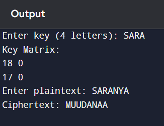

# Cryptography---19CS412-classical-techqniques
# Caeser Cipher
Caeser Cipher using with different key values

# AIM:

To encrypt and decrypt the given message by using Ceaser Cipher encryption algorithm.

# NAME: SARANYA S.
# REGISTER N0:212223220101
# DATE: 20-02-2025

## DESIGN STEPS:

### Step 1:

Design of Caeser Cipher algorithnm 

### Step 2:

Implementation using C or pyhton code

### Step 3:

1.	In Ceaser Cipher each letter in the plaintext is replaced by a letter some fixed number of positions down the alphabet.
2.	For example, with a left shift of 3, D would be replaced by A, E would become B, and so on.
3.	The encryption can also be represented using modular arithmetic by first transforming the letters into numbers, according to the   
    scheme, A = 0, B = 1, Z = 25.
4.	Encryption of a letter x by a shift n can be described mathematically as,
                       En(x) = (x + n) mod26
5.	Decryption is performed similarly,
                       Dn (x)=(x - n) mod26


## PROGRAM:
PROGRAM:
```
CaearCipher.
#include <stdio.h>
 #include <string.h>
 #include <ctype.h>
 int main() {
 char plain[100], cipher[100];
 int key, i, length;
 printf("Enter the plain text: ");
 scanf("%s", plain);
printf("Enter the key value: ");
 scanf("%d", &key);
 printf("\nPLAIN TEXT: %s", plain);
 printf("\nENCRYPTED TEXT: ");
 length = strlen(plain);
 for (i = 0; i < length; i++) {
 cipher[i] = plain[i] + key;
 // Handling uppercase letters
 if (isupper(plain[i]) && cipher[i] > 'Z') {
 cipher[i] = cipher[i]- 26;
 }
 // Handling lowercase letters
 if (islower(plain[i]) && cipher[i] > 'z') {
 cipher[i] = cipher[i]- 26;
 }
 printf("%c", cipher[i]);
 }
 cipher[length] = '\0'; // Null-terminate the cipher text string
 printf("\nDECRYPTED TEXT: ");
 for (i = 0; i < length; i++) {
 plain[i] = cipher[i]- key;
 // Handling uppercase letters
 if (isupper(cipher[i]) && plain[i] < 'A') {
 plain[i] = plain[i] + 26;
 }
 // Handling lowercase letters
if (islower(cipher[i]) && plain[i] < 'a') {
 plain[i] = plain[i] + 26;
 }
 printf("%c", plain[i]);
 }
 plain[length] = '\0'; // Null-terminate the plain text string
 return 0;
 }
```
## OUTPUT:


## RESULT:
The program is executed successfully

---------------------------------

# PlayFair Cipher
Playfair Cipher using with different key values

# NAME: SARANYA S.
# REGISTER NO: 212223220101
# DATE: 20-03-2025
# AIM:

To implement a program to encrypt a plain text and decrypt a cipher text using play fair Cipher substitution technique.

 
## DESIGN STEPS:

### Step 1:

Design of PlayFair Cipher algorithnm 

### Step 2:

Implementation using C or pyhton code

### Step 3:

Testing algorithm with different key values. 

ALGORITHM DESCRIPTION:
The Playfair cipher uses a 5 by 5 table containing a key word or phrase. To generate the key table, first fill the spaces in the table with the letters of the keyword, then fill the remaining spaces with the rest of the letters of the alphabet in order (usually omitting "Q" to reduce the alphabet to fit; other versions put both "I" and "J" in the same space). The key can be written in the top rows of the table, from left to right, or in some other pattern, such as a spiral beginning in the upper-left-hand corner and ending in the centre.
The keyword together with the conventions for filling in the 5 by 5 table constitutes the cipher key. To encrypt a message, one would break the message into digrams (groups of 2 letters) such that, for example, "HelloWorld" becomes "HE LL OW OR LD", and map them out on the key table. Then apply the following 4 rules, to each pair of letters in the plaintext:
1.	If both letters are the same (or only one letter is left), add an "X" after the first letter. Encrypt the new pair and continue. Some   
   variants of Playfair use "Q" instead of "X", but any letter, itself uncommon as a repeated pair, will do.
2.	If the letters appear on the same row of your table, replace them with the letters to their immediate right respectively (wrapping 
   around to the left side of the row if a letter in the original pair was on the right side of the row).
3.	If the letters appear on the same column of your table, replace them with the letters immediately below respectively (wrapping around 
   to the top side of the column if a letter in the original pair was on the bottom side of the column).
4.	If the letters are not on the same row or column, replace them with the letters on the same row respectively but at the other pair of 
   corners of the rectangle defined by the original pair. The order is important – the first letter of the encrypted pair is the one that 
    lies on the same row as the first letter of the plaintext pair.
To decrypt, use the INVERSE (opposite) of the last 3 rules, and the 1st as-is (dropping any extra "X"s, or "Q"s that do not make sense in the final message when finished).


## PROGRAM:
```
#include <stdio.h>
#include <string.h>
#include <ctype.h>
#define MX 5

void encryptPair(char ch1, char ch2, char key[MX][MX])
{
    int i, j, row1 = -1, col1 = -1, row2 = -1, col2 = -1;
    for (i = 0; i < MX; i++)
    {
        for (j = 0; j < MX; j++)
        {
            if (key[i][j] == ch1)
            {
                row1 = i;
                col1 = j;
            }
            else if (key[i][j] == ch2)
            {
                row2 = i;
                col2 = j;
            }
        }
    }
    if (row1 == row2)
        printf("%c%c", key[row1][(col1 + 1) % 5], key[row2][(col2 + 1) % 5]);
    else if (col1 == col2)
        printf("%c%c", key[(row1 + 1) % 5][col1], key[(row2 + 1) % 5][col2]);
    else
        printf("%c%c", key[row1][col2], key[row2][col1]);
}

void decryptPair(char ch1, char ch2, char key[MX][MX])
{
    int i, j, row1 = -1, col1 = -1, row2 = -1, col2 = -1;
    for (i = 0; i < MX; i++)
    {
        for (j = 0; j < MX; j++)
        {
            if (key[i][j] == ch1)
            {
                row1 = i;
                col1 = j;
            }
            else if (key[i][j] == ch2)
            {
                row2 = i;
                col2 = j;
            }
        }
    }
    if (row1 == row2)
        printf("%c%c", key[row1][(col1 + 4) % 5], key[row2][(col2 + 4) % 5]);
    else if (col1 == col2)
        printf("%c%c", key[(row1 + 4) % 5][col1], key[(row2 + 4) % 5][col2]);
    else
        printf("%c%c", key[row1][col2], key[row2][col1]);
}

int main()
{
    int i, j, k = 0, m = 0;
    char key[MX][MX], keyminus[25], keystr[25], plaintext[100];
    char alpha[26] = "ABCDEFGHIKLMNOPQRSTUVWXYZ";

    printf("Simulating Playfair Cipher\n");
    printf("Key text: ");
    fgets(keystr, sizeof(keystr), stdin);
    keystr[strcspn(keystr, "\n")] = 0;

    printf("Plain text: ");
    fgets(plaintext, sizeof(plaintext), stdin);
    plaintext[strcspn(plaintext, "\n")] = 0;

    for (i = 0; i < strlen(keystr); i++)
    {
        if (tolower(keystr[i]) == 'j')
            keystr[i] = 'I';
        keystr[i] = toupper(keystr[i]);
    }

    for (i = 0; i < strlen(plaintext); i++)
    {
        if (tolower(plaintext[i]) == 'j')
            plaintext[i] = 'I';
        plaintext[i] = toupper(plaintext[i]);
    }

    int n = strlen(keystr), found;
    for (i = 0; i < 25; i++)
    {
        found = 0;
        for (j = 0; j < n; j++)
        {
            if (keystr[j] == alpha[i])
            {
                found = 1;
                break;
            }
        }
        if (!found)
            keyminus[m++] = alpha[i];
    }

    k = 0;
    m = 0;
    for (i = 0; i < MX; i++)
    {
        for (j = 0; j < MX; j++)
        {
            if (k < n)
                key[i][j] = keystr[k++];
            else
                key[i][j] = keyminus[m++];
        }
    }

    printf("Cipher text: ");
    for (i = 0; i < strlen(plaintext); i++)
    {
        if (plaintext[i + 1] == '\0')
        {
            encryptPair(plaintext[i], 'X', key);
        }
        else if (plaintext[i] == plaintext[i + 1])
        {
            encryptPair(plaintext[i], 'X', key);
        }
        else
        {
            encryptPair(plaintext[i], plaintext[i + 1], key);
            i++;
        }
    }

    printf("\nDecrypted text: %s\n", plaintext);
    return 0;
}

```
## OUTPUT:


## RESULT:
The program is executed successfully


---------------------------

# Hill Cipher
Hill Cipher using with different key values

# AIM:

To develop a simple C program to implement Hill Cipher

## NAME: SARANYA S.

## REG NO: 212223220101

## DATE: 27/03/2025

## DESIGN STEPS:

### Step 1:

Design of Hill Cipher algorithnm 

### Step 2:

Implementation using C or pyhton code

### Step 3:

Testing algorithm with different key values. 
ALGORITHM DESCRIPTION:
The Hill cipher is a substitution cipher invented by Lester S. Hill in 1929. Each letter is represented by a number modulo 26. To encrypt a message, each block of n letters is multiplied by an invertible n × n matrix, again modulus 26.
To decrypt the message, each block is multiplied by the inverse of the matrix used for encryption. The matrix used for encryption is the cipher key, and it should be chosen randomly from the set of invertible n × n matrices (modulo 26).
The cipher can, be adapted to an alphabet with any number of letters. All arithmetic just needs to be done modulo the number of letters instead of modulo 26.


## PROGRAM:
PROGRAM:
```
#include <stdio.h>
#include <string.h>
#include <ctype.h>

#define SIZE 2  // Size of the key matrix (2x2 for simplicity)

int keyMatrix[SIZE][SIZE];

void toUpperCase(char *str) {
    for (int i = 0; str[i]; i++) {
        str[i] = toupper(str[i]);
    }
}

void removeSpaces(char *str) {
    int count = 0;
    for (int i = 0; str[i]; i++) {
        if (str[i] != ' ') {
            str[count++] = str[i];
        }
    }
    str[count] = '\0';
}

void getKeyMatrix(char *key) {
    int k = 0;
    toUpperCase(key);
    removeSpaces(key);
    for (int i = 0; i < SIZE; i++) {
        for (int j = 0; j < SIZE; j++) {
            keyMatrix[i][j] = key[k++] - 'A';
        }
    }
}

void encrypt(char *text, char *cipher) {
    toUpperCase(text);
    removeSpaces(text);
    int len = strlen(text);
    if (len % SIZE != 0) {
        text[len++] = 'X';  // Padding if needed
        text[len] = '\0';
    }
    
    for (int i = 0; i < len; i += SIZE) {
        for (int row = 0; row < SIZE; row++) {
            int sum = 0;
            for (int col = 0; col < SIZE; col++) {
                sum += keyMatrix[row][col] * (text[i + col] - 'A');
            }
            cipher[i + row] = (sum % 26) + 'A';
        }
    }
    cipher[len] = '\0';
}

void printKeyMatrix() {
    printf("Key Matrix:\n");
    for (int i = 0; i < SIZE; i++) {
        for (int j = 0; j < SIZE; j++) {
            printf("%d ", keyMatrix[i][j]);
        }
        printf("\n");
    }
}

int main() {
    char key[SIZE * SIZE + 1], text[100], cipher[100];
    
    printf("Enter key (4 letters): ");
    scanf("%s", key);
    getKeyMatrix(key);
    printKeyMatrix();
    
    printf("Enter plaintext: ");
    scanf("%s", text);
    
    encrypt(text, cipher);
    printf("Ciphertext: %s\n", cipher);
    
    return 0;
}
```

## OUTPUT:
OUTPUT:



## RESULT:
The program is executed successfully

-------------------------------------------------

# Vigenere Cipher
Vigenere Cipher using with different key values

# AIM:

To develop a simple C program to implement Vigenere Cipher.

## DESIGN STEPS:

### Step 1:

Design of Vigenere Cipher algorithnm 

### Step 2:

Implementation using C or pyhton code

### Step 3:

Testing algorithm with different key values. 
ALGORITHM DESCRIPTION:
The Vigenere cipher is a method of encrypting alphabetic text by using a series of different Caesar ciphers based on the letters of a keyword. It is a simple form of polyalphabetic substitution.To encrypt, a table of alphabets can be used, termed a Vigenere square, or Vigenere table. It consists of the alphabet written out 26 times in different rows, each alphabet shifted cyclically to the left compared to the previous alphabet, corresponding to the 26 possible Caesar ciphers. At different points in the encryption process, the cipher uses a different alphabet from one of the rows used. The alphabet at each point depends on a repeating keyword.


## PROGRAM:
PROGRAM:
#include<stdio.h> #include<string.h>
//FunctiontoperformVigenereencryption voidvigenereEncrypt(char*text,constchar*key){ inttextLen= strlen(text);
intkeyLen=strlen(key); for(inti =0;i< textLen;i++){ charc =text[i]; if(c>='A'&&c<='Z'){
//Encryptuppercaseletters
text[i]=((c-'A'+key[i%keyLen]-'A')%26)+'A';
}else if(c>='a'&&c<='z'){
//Encryptlowercaseletters
text[i]=((c-'a'+key[i%keyLen]-'A')%26)+'a';
}
}
}
//FunctiontoperformVigeneredecryption voidvigenereDecrypt(char*text,constchar*key){ inttextLen= strlen(text);
intkeyLen=strlen(key);

for(inti =0;i< textLen;i++){ charc =text[i]; if(c>='A'&&c<='Z'){
//Decryptuppercaseletters
 
text[i]=((c-'A'-(key[i% keyLen]-'A') +26) %26)+ 'A';
}else if(c>='a'&&c<='z'){
//Decryptlowercaseletters
text[i]=((c-'a'-(key[i% keyLen]-'A') +26) %26)+ 'a';
}
}
}
intmain(){
constchar *key="KEY";//Replacewithyourdesired key
char message[]= "Thisisasecretmessage.";//Replace withyourmessage
//Encrypt themessage vigenereEncrypt(message,key); printf("EncryptedMessage:%s\n",message);
//Decrypt themessage backtotheoriginal vigenereDecrypt(message,key); printf("DecryptedMessage:%s\n",message); Return 0;

## OUTPUT:
OUTPUT :

Simulating Vigenere Cipher


Input Message : SecurityLaboratory
Encrypted Message : NMIYEMKCNIQVVROWXC Decrypted Message : SECURITYLABORATORY
## RESULT:
The program is executed successfully

-----------------------------------------------------------------------

# Rail Fence Cipher
Rail Fence Cipher using with different key values

# AIM:

To develop a simple C program to implement Rail Fence Cipher.

## DESIGN STEPS:

### Step 1:

Design of Rail Fence Cipher algorithnm 

### Step 2:

Implementation using C or pyhton code

### Step 3:

Testing algorithm with different key values. 
ALGORITHM DESCRIPTION:
In the rail fence cipher, the plaintext is written downwards and diagonally on successive "rails" of an imaginary fence, then moving up when we reach the bottom rail. When we reach the top rail, the message is written downwards again until the whole plaintext is written out. The message is then read off in rows.

## PROGRAM:

PROGRAM:
#include<stdio.h> #include<string.h> #include<stdlib.h> main()
{
int i,j,len,rails,count,code[100][1000]; char str[1000];
printf("Enter a Secret Message\n"); gets(str);
len=strlen(str);
printf("Enter number of rails\n"); scanf("%d",&rails); for(i=0;i<rails;i++)
{
for(j=0;j<len;j++)
{
code[i][j]=0;
}
}
count=0; j=0;
while(j<len)
{
if(count%2==0)
{
for(i=0;i<rails;i++)
{
//strcpy(code[i][j],str[j]);
code[i][j]=(int)str[j]; j++;
}

}
else
{
 
for(i=rails-2;i>0;i--)
{
code[i][j]=(int)str[j]; j++;
}
}

count++;
}

for(i=0;i<rails;i++)
{
for(j=0;j<len;j++)
{
if(code[i][j]!=0) printf("%c",code[i][j]);
}
}
printf("\n");
}
## OUTPUT:
OUTPUT:
Enter a Secret Message wearediscovered
Enter number of rails 2
waeicvrderdsoee
## RESULT:
The program is executed successfully
